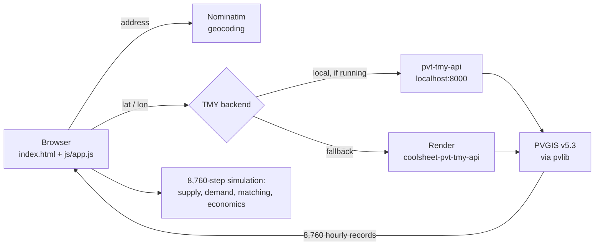

# CoolSheet PVT Calculator

Web tool that estimates annual energy output, industry heat demand matching, and
payback for photovoltaic-thermal (PVT) solar systems at Australian commercial
sites. It simulates all 8,760 hours of a typical meteorological year.

- **Live:** <https://coolsheet-pvt.github.io/>
- **Repo:** `coolsheet-pvt/coolsheet-pvt.github.io` (GitHub Pages serves `main` directly)
- **Weather backend:** <https://coolsheet-pvt-tmy-api.onrender.com>

---

## Quick start

Requires **Node 22** and **Python 3.12** (the versions CI uses).

```bash
npm install
npx playwright install chromium    # once, for browser tests
```

**Frontend only** — the hosted backend supplies weather, so this is enough to
use the tool:

```bash
python -m http.server 8080
# open http://localhost:8080
```

**With the local weather backend** (avoids Render cold starts, needed for
`/email-report` work):

```bash
cd pvt-tmy-api
python -m venv .venv
./.venv/bin/pip install -r requirements.txt
./.venv/bin/python server.py          # serves http://localhost:8000
```

The frontend tries `127.0.0.1:8000` first and silently falls back to Render when
it is not running. You will see one `ERR_CONNECTION_REFUSED` in the console when
that happens — it is expected, not a fault.

---

## How it fits together



The frontend is **vanilla HTML/JS with no build step** — edit and reload. The
only vendored dependency is Chart.js (`assets/vendor/chart.umd.min.js`).
`npm` is used purely for the test runner.

The backend is a single-file FastAPI app that wraps PVGIS, localises timestamps
to the site timezone, and caches responses in memory for 24 h. It exposes
`/health`, `GET|POST /tmy`, and `POST /email-report`. Its response contract is
versioned (`TMY_API_CONTRACT_VERSION = "2.1"`) and enforced by
`npm run test:weather-contract`.

---

## Repository layout

| Path | Purpose |
|---|---|
| `index.html` | The entire calculator UI |
| `js/app.js` | **~7,900 lines — all application logic.** Sectioned by banner comments (`// MAIN CALCULATION`, `// MAINS WATER TEMPERATURE MODEL`, …); grep those to navigate |
| `js/bc_aus_zone_constants.js` | Generated BC-Aus zone constants — **do not hand-edit** |
| `js/cer_postcode_zones.js` | Postcode → climate-zone lookup |
| `js/ui-modern.js`, `css/ui-modern.css` | Dormant alternative theme. Not referenced by any HTML |
| `css/styles.css` | All styling, including the mobile media queries |
| `pages/` | Validation and comparison pages (BC-Aus, NSOP field data, PV external checks) |
| `pvt-tmy-api/server.py` | FastAPI weather backend |
| `tools/` | Python scripts that generate the BC-Aus constants |
| `validation/` | Tests, locked fixtures and evidence — see `validation/README.md` |
| `docs/` | Model specification, audits, assumptions |

---

## The model

**Supply side.** Isotropic diffuse transposition onto the tilted plane, then two
selectable thermal models:

| | Model A (default) | Model B |
|---|---|---|
| Form | Inlet-based linear | ISO 9806 Eq. 12, Newton iteration on outlet temp |
| Coefficients | `a0 = 0.2800`, `a1 = −10.53`, `a2 = −0.00814` | `η0 = 0.762`, `a1 = 3.93`, `a2 = 0.0095` |
| Reduced temperature | **Inlet** temperature | **Mean fluid** temperature |

The two coefficient sets are **not interchangeable** — one is inlet-based, the
other mean-based. The two models produce materially different thermal yields for
the same scenario; `docs/independent-model-audit-2026-07-10.md` quantifies the
gap.

PV electricity uses NOCT (default 45 °C) for cell temperature, a −0.40 %/°C
coefficient against a 25 °C STC reference, then an AC delivery factor of
`(1 − system loss) × inverter efficiency` (default `0.86 × 0.96 = 0.826`). The
"cooling gain" is the difference between the same STC yield derated at the
uncooled panel temperature versus the fluid-cooled one.

**Demand side.** Per-industry hourly heat profiles built from throughput
(milk L/yr, beer L/yr, occupied room-nights, pool area). Supply and demand are
matched hour by hour; solar covers demand first, boiler and grid cover the rest.

**Mains water — BC-Aus.** A regionally refitted Burch & Christensen model
calibrated to CER TRNSYS domestic decks across the five AS/NZS 4234 climate
zones (in-sample RMSE 0.70 °C). Regenerate with:

```bash
python tools/fit_bc_aus_by_zone.py --check    # verifies determinism
```

---

## Model locks — read before changing anything

`docs/assumptions-and-limitations.md` records constraints agreed with the
project supervisor. In short:

- Model A and Model B equations **and coefficients** are frozen. Changing them
  requires explicit approval.
- Isotropic transposition is the core irradiance model. Perez may be used only
  as a benchmark.
- PVGIS `IR(h)` is **prohibited** from entering Model B — long-wave uses
  Swinbank only. This is enforced by `npm run test:weather-contract`.

`validation/unit/test_pvt_models.mjs` holds numeric locks that will fail loudly
if a coefficient moves. That is deliberate.

---

## Validation and tests

```bash
npm test                      # 21 offline suites (Node + Python), no network
npm run test:browser          # Playwright smoke against local index.html
npm run test:live-industries  # drives the deployed site; needs network
npm run test:links            # live URL checks; needs network
npm run fixtures:weather      # refreshes locked weather fixtures from live PVGIS
```

`npm test` is the gate — it must be green before any push. It covers geometry,
the two PVT models, PV boundary and external validation, economics, industry
demand, weather fixtures and contract, mains zones, NaN sweeps, export/share
state, and input parsing.

CI (`.github/workflows/validation.yml`) runs `npm test` plus the browser smoke
on **every push to every branch**.

Fixture refresh pulls live PVGIS data and changes committed evidence — review
the diff before accepting it.

---

## Deployment and operations

**Frontend.** GitHub Pages serves `main` directly. A push is a deploy; there is
no build. Cache-busting is manual: bump the `?v=` query on the CSS/JS tags in
`index.html` when shipping changes, and keep it in step with `APP_VERSION` at
the top of `js/app.js`.

**Backend.** Render free tier, which stops the instance after ~15 minutes idle.
A cold start can exceed the frontend's request timeout, so
`.github/workflows/keep-warm.yml` pings `/health` every 10 minutes. This is a
mitigation, not a guarantee — GitHub does not run scheduled workflows on time,
and it disables schedules on repos with 60 days of no activity. **A paid Render
plan removes the problem entirely** and is the recommended fix.

Pushing anything under `.github/workflows/` needs a token with the `workflow`
scope.

**Email reports.** Copy `pvt-tmy-api/.env.example` to `.env` and set
`SMTP_HOST` and `SMTP_FROM` (most providers also need `SMTP_USER` /
`SMTP_PASSWORD`). Port 587 with `SMTP_TLS=true`, or 465 with `SMTP_SSL=true`.
`.env` is gitignored.

---

## Documentation index

| Document | What it covers |
|---|---|
| `docs/model-specification.md` | Authoritative equations for both PVT models |
| `docs/assumptions-and-limitations.md` | Model locks and scope boundaries |
| `docs/audit-report-2026-07.md` | Full repository audit, July 2026 |
| `docs/independent-model-audit-2026-07-10.md` | Independent review of the model |
| `docs/validation-report.md` | Validation results |
| `docs/test-matrix.md` | What each test covers |
| `docs/reproducibility.md` | Reproducing thesis results |
| `docs/industry-demand-assumptions.md` | Per-industry demand derivations |
| `docs/thesis/` | Thesis-specific write-ups and figures |
| `validation/VALIDATION_RECORD.md` | Locked evidence record |

---

## Authors

Built by **Michael Lo Russo**, **Thai An (Evan) Dang** and **Jason Fu** at
UNSW Sydney.

---

## Built with

Vanilla HTML/JavaScript · Chart.js · Python / FastAPI / pvlib · Playwright
